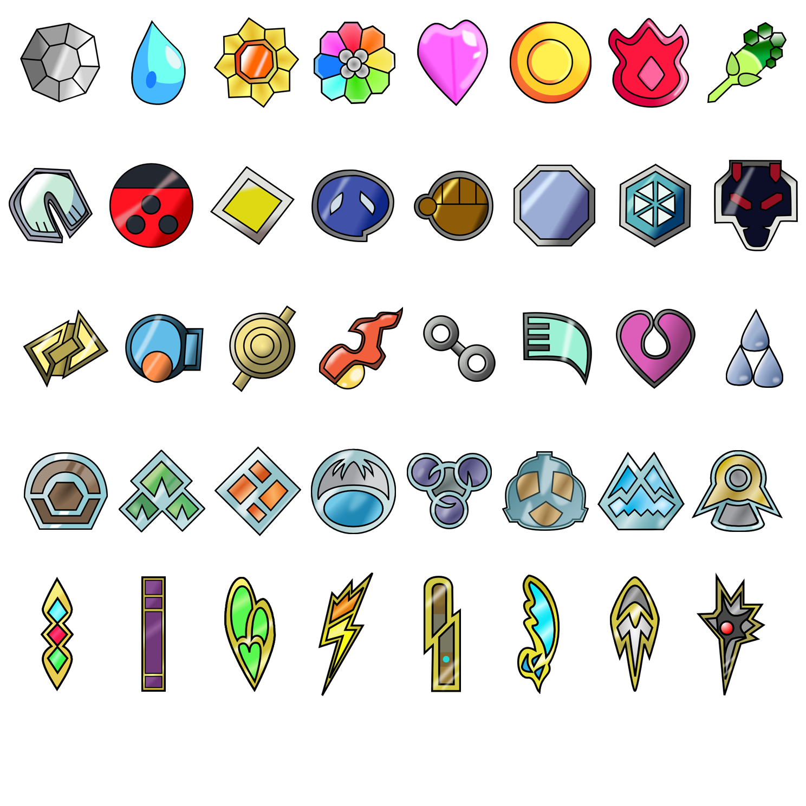

# Pokémon League Badges

SVG recreations of the first 40 Pokémon badges, from Kanto (Pokémon Red, Blue, and Yellow) to Unova (Pokémon Black and White 1). They are organised by region in the `/svg` folder.

Source: [Bulbapedia][bulb]

These were created in March 2011.

## LICENSE

Stephen Griffiths 2011

This work is licensed under a [Creative Commons Attribution 3.0 Unported License][cc].

[cc]: http://creativecommons.org/licenses/by/3.0/
[bulb]: http://bulbapedia.bulbagarden.net/wiki/Badge
